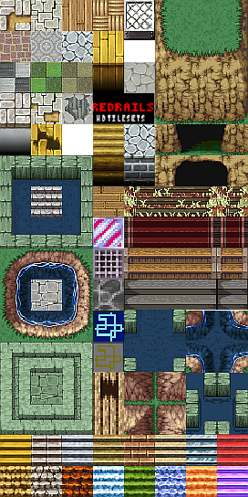

EasyTilesetFixer4AndEngine (ETF4AE) is easy  tool for transform the most useds tileset format for the format used in framework for game AndEngine

Tileset usual format
--------------------
    Tile Size: 32px
    spacing:  0px
    margin: 0px
    no aditional requires

## Tileset used in AndEngine format
    Tile Size: 34px (ETF4AE do not resize tileset) 
    Spacing: 2px;
    Margin: 3px;
    add: 1px space in each corner

## Initial procedures
if you need resize tile, without interpolation, for purchase tiles with 32px use tools like photoshop,fireworks (using nearest neighbor) or GIMP.
Change for percent and insert size informatins 106,25% of Width and 106,25% of Height

## Usage
download and uncompress the [fixer4ae.zip](https://github.com/LuizCarvalho/EasyTilesetFixer4AndEngine/blob/master/dist/fixer4ae.zip)

for quick use copy your tileset image in same folder of the fixer4ae.jar with name input.png and tiles with 34px and run command
    java -jar fixer4ae.jar 

for custom options use -u options and show the usage commands
    java -jar fixer4ae.jar -u

Original Source:
[Nicolas Gramlich](http://code.google.com/p/andenginetmxtiledmapartifactfixer/)

Autor:[Luiz Carvalho](http://www.twitter.com/LuizCarvalho)
Blog: [RedRails](http://www.redrails.com.br)

